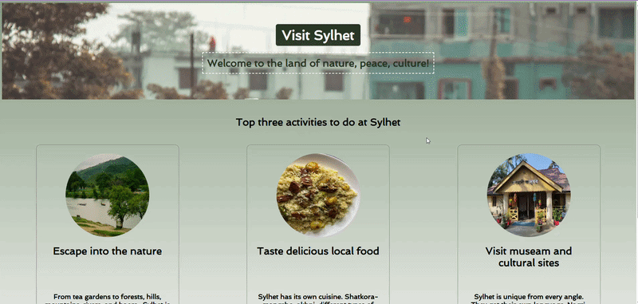

# web-dev
This repo contains code exercises from my web development course as well as some fun mini projects that I practiced along the way.

**part-i | Language Foundations**
---
- Chapter 1: Getting Started
- Chapter 2: Variables and Data Types
- Chapter 3: Operators and Control Flow
- Chapter 4: Loops
- Chapter 5: Functions
- Chapter 6: Arrays 
- Chapter 7: Objects and JSON

**part-ii | Modern JavaScript in Practice**
---
- Chapter 8: Scope, Hoisting, and Closures
- Chapter 9: The DOM — JavaScript in the Browser
- Chapter 10: Asynchronous JavaScript
- Chapter 11: Errors, Debugging, and Clean Code
- Chapter 12: ES6+ Toolbox — Modules, Classes, Map/Set, and Friends

**Mini-projects**
---
<<<<<<< HEAD
> HTML, CSS [one-pagers]
**1. surpriseME:** A fun website for surprise gift

**2. tripSyl:** Travel info website

**3. mycard:** A simple interactive personal info card

**4. spaceEX:** Space event join website

=======
> html, css
1. birthday_website: a fun website for surprise gift

2. tripSyl: one page travel info website

3. business_card: a simple interactive personal info card

4. space_exploration: one page space event join website

>>>>>>> 0698db8b3e8ee3683aa6fc92f6643926f2e969db

